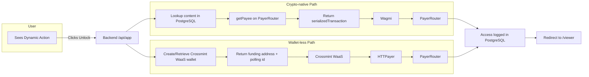

# **Product Requirements Document**

**Payer Tiger (💲,🐅)**

## **Project Overview**

Payer Tiger is a decentralized monetization protocol and application that allows
content creators to receive direct, low-friction payments from their audience.
It leverages the Sherry SDK for a seamless user experience within social
platforms and uses on-chain smart contracts for censorship-resistant payment
routing and verification.

Payer Tiger supports both crypto-native and wallet-less payment paths. For
wallet-less users, we use Crossmint WaaS to provision custodial wallets and
abstract gas, while HTTPayer executes on-chain settlement to the `PayerRouter`
on behalf of custodial wallets. No fiat on-ramp or credit card processing is
included in the current region.

1. **Logical thinking**
   - **what is the game?** The game is to create a monetization system where the
     core payment rails are a public good, owned by the users, not a central
     platform. We win by empowering creators with a censorship-resistant income
     stream and providing followers with a seamless way to pay.
   - **project overview:** This project will deliver a functional
     proof-of-concept demonstrating an end-to-end payment and secure content
     delivery flow. A user will pay a creator for content via a Sherry Mini-App,
     with the payment routed and logged by our on-chain `PayerRouter` contract.
     Access to the content will be secured via a signature-gated viewer page.

### **Level**

Medium to Hard. The project involves smart contract interaction, a multicall
transaction pattern, backend state management, and a signature-based
authentication flow.

### **Type of Project**

Fintech, Web3, Creator Economy, Decentralized Protocol

### **Skills Required**

- **Frontend:** Next.js (App Router & React Server Components), TypeScript,
  `viem`/`wagmi`
- **Frontend Data Layer:** TanStack Query (data fetching, caching, polling)
- **Backend:** Next.js (Route Handlers), Node.js
- **Database:** Prisma Postgres with Drizzle ORM
- **Smart Contracts:** Solidity, Foundry
- **Web3 Concepts:** ERC20 (`approve`/`transferFrom`), multicall transaction
  patterns, EIP-4361 (Sign-In with Ethereum)
- **Deployment:** Vercel
- **Package Manager:** pnpm
- **Wallet:** MetaMask, Core, Crossmint WaaS

### **Tech Stack Capabilities**

- **Next.js App Router + RSC:** Server-first rendering, secure server-only data access, and streaming UI; client components used only for interactive wallet/auth flows.
- **TanStack Query:** Declarative fetching, caching, and polling; powers custodial payment status checks and access verification with retry/backoff.
- **Zod:** Runtime validation for API inputs/outputs and environment variables; inferred types unify server contracts and client usage.
- **`viem`/`wagmi`:** Robust JSON-RPC and wallet connectivity for crypto-native signing flows.
- **Prisma + Drizzle:** Typed schema/migrations and composable queries for `content` and `access_records`.
- **Crossmint WaaS:** Custodial wallet provisioning and auth for wallet-less users; gas abstraction.
- **Vercel:** Preview deployments and serverless scaling for API routes.

2. **Analytical thinking**
   - **how do i play this game?** By building the specified MVP exactly as
     described, focusing on a flawless end-to-end demo.
    - **main objective and goal of this game?** To evolve Payer Tiger into a
      production-grade protocol and application that delivers a complex, useful,
      and secure smart contract interaction.
   - **skills and tools:** See "Skills Required" above.

### **Status**

In Development

### **Target release**

Post-hackathon pilot rollout (TBD)

## **Customer Information (Buyer Persona)**

- **Creator (The "Seller"):** A crypto-savvy content creator who produces
  valuable digital content (articles, videos, analysis). They are frustrated
  with the fees and restrictions of Web2 platforms and desire a direct,
  censorship-resistant way to monetize their work.
- **Follower (The "Buyer"):** A member of the broad public who follows the
  creator. For the MVP, we assume they are crypto-curious and have a
  browser-based EVM wallet (e.g., MetaMask, Core) with `USDC` on Avalanche Fuji.
  In further stages of the project the blockchain complexity will be abstracted
  away. We assume they can manage a wallet for now.

## **Goals (Business Objectives)**

1. **Primary Goal:** Deliver a functional, end-to-end MVP ready for pilot
   rollouts and stakeholder demos.
2. **Secondary Goal:** Prove the core value proposition of a secure, on-chain
   payment system combined with a signature-gated content delivery mechanism.
3. **Tertiary Goal:** Establish a foundational codebase for a future,
   fully-featured Payer Tiger protocol.

## **Background and Strategic Fit**

This project began as a self-contained proof-of-concept and is now focused on
post-hackathon productization. It explores a new primitive for the creator
economy, aligning with the broader industry trend towards decentralized and
user-owned systems.

## **Assumptions**

- The `PayerRouter` smart contract is deployed on Avalanche Fuji at a known
  address.
- The user (follower) has a browser wallet installed and funded with `USDC` and
  `AVAX` (for gas) on Avalanche Fuji.
- The creator setup (on-chain registration, content paywalling) will be handled
  manually by the development team for the MVP demo.
- The application state (paywalled content, access records) is stored in a
  PostgreSQL database.
- Crossmint WaaS and HTTPayer API keys are available for wallet-less flows.
- The user experience is optimized for desktop browsers.

## **Key Features (User Stories)**

3. **Computational thinking**
   - **how to fit the logic of the game into a complicated set of problems?** By
     breaking the flow into distinct user stories and defining the precise
     technical implementation for each step, from payment to secure delivery.
   - **how do you enforce these rules?** The rules are enforced by a combination
     of the immutable logic in the `PayerRouter` smart contract and the
     authorization checks in our backend API.

### **Epic: MVP End-to-End Monetization Flow**

#### **User Story 1: Creator Onboarding & Content Sharing**

**As a** content creator, **I want to** register my payment information on-chain
and share my premium content with followers via social media, **so that** I can
monetize my work directly and securely.

**Acceptance Criteria:**

1. **On-Chain Registration:** The creator (or developer on their behalf) calls
   `addPayee(creatorHandle, creatorAddress)` on the deployed `PayerRouter`
   contract using tools like Remix or Foundry.
2. **Content Setup:** The creator's premium content is added to the system via
   the `content` table in PostgreSQL with `contentId`, `title`, `unlockableUrl`,
   and `priceUSDC`.
3. **Social Media Sharing:** The creator shares their Sherry Mini-App link on
   social platforms with specific query parameters:
   ```
   https://payer-tiger-app.vercel.app/api/app?creatorHandle=@creator1&contentId=premium-article-123
   ```
4. **Dynamic Content Discovery:** The system can automatically create default
   content entries for testing and development when the `content` table is
   empty.

#### **User Story 2: Follower Payment & Access (Core MVP Flow)**

**As a** follower, **I want to** pay for a piece of content with a single click
and securely access it, **so that** I can support the creator and consume their
premium work without friction.

**Acceptance Criteria:**

1. **Payment Initiation:** The user clicks a Sherry Dynamic Action button
   ("Unlock Content for X USDC") from the creator's social media post.
2. **Backend Orchestration:** The backend API (`/api/app`) receives the request
   with `creatorHandle` and `contentId` parameters and executes the following
   logic based on payment path:
   - a) **Crypto-native:**
     - Reads `content` from PostgreSQL and looks up `priceUSDC` using
       `contentId`.
     - Calls `getPayee` on the `PayerRouter` contract to resolve the creator's
       address.
     - Constructs a single transaction calling `payAndLogAccess` on the
       `PayerRouter` contract and returns the `serializedTransaction` to Sherry
       as an `ExecutionResponse`.
   - b) **Wallet-less:**
     - Creates or retrieves a Crossmint WaaS custodial wallet for the user and
       returns a funding address.
     - Returns an identifier to allow the client to poll payment status.
     - Initiates an HTTPayer settlement job which, once funds are detected,
       calls `payAndLogAccess` on `PayerRouter` on behalf of the custodial
       wallet.
3. **User Signature:**
   - a) Crypto-native: The user is prompted by their wallet to sign one
     transaction.
   - b) Wallet-less: No on-chain signature by the user; the user authenticates
     with Crossmint for custodial wallet operations.
4. **Access Granting:** Upon successful on-chain confirmation, the backend
   writes the user's wallet address and the `contentId` to the `access_records`
   table in PostgreSQL.
5. **Redirection:** The user is redirected to the secure viewer page:
   `/viewer?contentId=...`.
6. **Secure Verification:**
   - a) Crypto-native: The `/viewer` page prompts the user to sign a gas-less
     message (SIWE).
   - b) Wallet-less: The `/viewer` page verifies the user via Crossmint WaaS
     custodial wallet authentication instead of SIWE.
7. **Content Delivery:** Upon successful verification against
   `access_records`, the premium content is rendered inside an `<iframe>` on the
   `/viewer` page.

8. **Procedural thinking**
   - **how do i excel in this game?** By implementing the detailed UX/UI flow
     below flawlessly, ensuring the transaction works, and the signature-gated
     access is secure.

## **Technical Implementation Details**

### **Backend API Structure**

- **GET `/api/app`:** Returns Sherry Dynamic Action metadata with proper validation (validated via Zod)
- **POST `/api/app`:** Handles payment transaction creation with query parameters (validated via Zod):
  - `creatorHandle`: Creator's social handle (e.g., "creator1")
  - `contentId`: Unique identifier for the content (e.g., "abc123")
- **POST `/api/payments/custodial`:** Initiates custodial wallet payment via HTTPayer (creates/looks up Crossmint WaaS wallet, returns funding address, enqueues settlement). Response schema enforced by Zod.
- **POST `/api/webhooks/crossmint`:** Handles Crossmint WaaS webhooks/events related to custodial wallet lifecycle and funding. Payload parsing and signature verification guarded by Zod schemas.

### **Database Management**

- **Schema:** PostgreSQL with two core tables:
  - `content(contentId PRIMARY KEY, title TEXT, unlockableUrl TEXT, priceUSDC NUMERIC)`
  - `access_records(id SERIAL PRIMARY KEY, userAddress TEXT, contentId TEXT REFERENCES content(contentId), txHash TEXT, createdAt TIMESTAMP DEFAULT now())`
- **Auto-Population (Dev):** Optional seed of default test content when the
  `content` table is empty.
- **Error Handling:** Comprehensive error responses with detailed debugging
  information.
- **Frontend Data:** TanStack Query powers content metadata fetching, custodial payment polling, and access verification, with cache keys aligned to Zod-typed contracts.

### **Smart Contract Integration**

- **Contract Address:** `0x994519B71387380F30Be925a75a5593cffacd401` (Fuji)
- **USDC Address:** `0x5425890298aed601595a70AB815c96711a31Bc65` (Fuji)
- **Functions Used:**
  - `getPayee(string _handle)`: Resolves creator handle to wallet address
  - `payAndLogAccess(bytes32 contentId, string creatorHandle, address token, uint256 amount)`:
    Processes payment
  - Note: For wallet-less flows, HTTPayer can call `payAndLogAccess` on behalf
    of Crossmint custodial wallets.

### **Frontend Architecture (RSC, TanStack Query, Zod)**

- **React Server Components:** Server components render non-interactive content metadata securely; client components handle wallet connection, SIWE prompts, and Crossmint auth UI.
- **TanStack Query:** Query functions typed via Zod schemas; polling for custodial confirmations; query boundaries colocated with client components; server components may prefetch.
- **Zod Validation:** API handlers validate inputs and produce typed responses; environment variables are validated at startup.

### **Development & Testing**

- **Test Script:** `app/scripts/test-post.ts` for endpoint testing
- **Error Debugging:** Enhanced error responses with detailed messages
- **Local Development:** PostgreSQL-backed state management for rapid iteration

### **Architecture Diagram**



## **UX/UI (User Interaction and Design)**

The MVP will have one single user-facing page: `/viewer`. It should be clean,
minimalist, and functional. Use Avalanche-branded UI components or a simple,
clean design.

### **The Creator Sharing Experience:**

1. **Content Creation:** Creator produces premium content and gets a unique
   `contentId`
2. **Link Generation:** Creator uses the Sherry Mini-App URL with their specific
   parameters:
   ```
   https://payer-tiger-app.vercel.app/api/app?creatorHandle=@myhandle&contentId=my-premium-post
   ```
3. **Social Sharing:** Creator posts this link on X, Arena, or other platforms
4. **Follower Discovery:** Followers see the Sherry Dynamic Action button
   directly in their feed

### **The `/viewer` Page Flow:**

1. **Initial State:** User lands on `/viewer?contentId=...`. The page displays:
   - A title: "Payer Tiger Content Access"
   - A message: "Please verify wallet ownership to access your purchased
     content."
   - A single button: **"Verify with Wallet"**.
2. **Verification Step:** User clicks the button.
   - Crypto-native: The application connects to their wallet and prompts a SIWE
     message (e.g., "Sign this message to prove you own this wallet and access
     your content.").
   - Wallet-less: The application authenticates the user via Crossmint custodial
     wallet login (no SIWE).
3. **Loading State:** While the backend verifies the signature, the button is
   disabled and shows a loading spinner.
4. **Success State:** If the backend returns success:
   - The title and button are removed.
   - The premium content is rendered in their place, embedded within an
     `<iframe>` that takes up the main view.
5. **Failure State:** If the backend returns an error (signature invalid,
   address not in access list):
   - An error message is displayed: "Access Denied. This wallet address has not
     purchased this content."

Additionally, TanStack Query performs resilient polling for custodial payment confirmation prior to redirecting the user to `/viewer` in the wallet-less flow. All request/response shapes are validated by Zod, and server-first rendering via RSC minimizes client-side complexity.

## **Questions**

- **How is content paywalled for the MVP?**
  - **Answer:** Via records stored in a PostgreSQL `content` table. Optionally
    pre-seeded with development defaults.
- **How is access secured to prevent link sharing?**
  - **Answer:** Via a signature-gated `/viewer` page that requires the user to
    prove ownership of the wallet that made the purchase (Sign-In with
    Ethereum).
- **How do creators share content with followers?**
  - **Answer:** Creators share Sherry Mini-App URLs with specific query
    parameters (`creatorHandle` and `contentId`) on social media platforms.
- **How are wallet-less payments handled?**
  - **Answer:** Via Crossmint WaaS custodial wallets, with HTTPayer executing the
    on-chain payment to `PayerRouter` and logging access on completion.

## **Not Doing (MVP Scope)**

- **No Creator UI/Dashboard:** All creator setup is manual for MVP.
- **No Cross-Chain Functionality:** The system is exclusively for Avalanche
  Fuji.
- **No Other Tokens:** Payments are exclusively in `USDC`.
- **No Multicall Implementation:** For MVP simplicity, using single contract
  calls.
