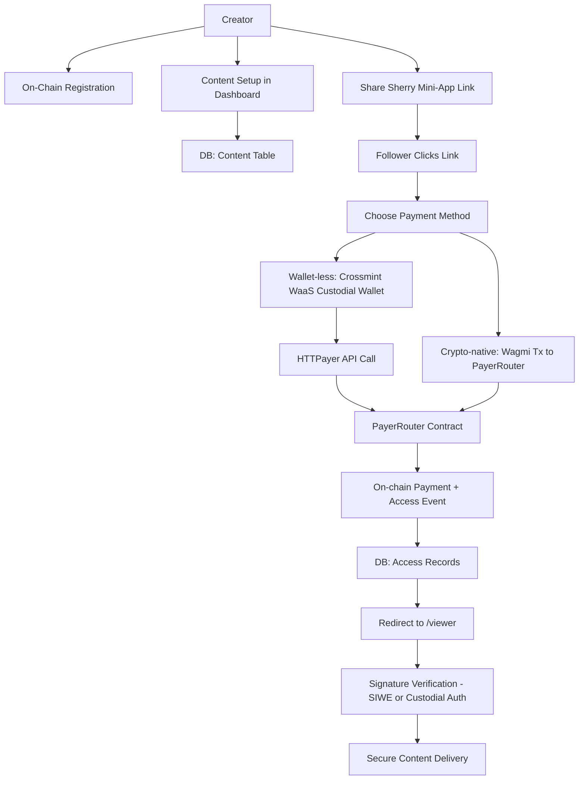

# **Payer Tiger (💲,🐅)**

Payer Tiger is a monetization toolkit for creators on platforms like X (f.k.a. Twitter) and Arena. It leverages the Sherry SDK to enable direct, on-platform, and low-friction payments, allowing creators to earn from their content with a single click.

In **Payer Tiger**, we support:

- **Crypto-native payments** via MetaMask/Core wallets.
- **Wallet-less payments** via **Crossmint WaaS** (custodial wallets + gas abstraction).
- **Backend settlement** via [**HTTPayer**](https://github.com/brandynhamilton/httpayer) for custodial wallet transactions.

---

## **The Problem: Creator Monetization is Broken**

Creators build valuable communities but face significant friction when trying to monetize their work. The current landscape is inefficient and costly:

- **High Friction:** Off-platform links to Patreon or Gumroad kill conversion by forcing users through cumbersome, multi-step checkout flows.
- **Inflexible Models:** Platform subscriptions are often "all-or-nothing," preventing creators from selling access to individual articles, videos, or receiving one-off tips.
- **Exorbitant Fees:** Centralized platforms and payment processors can take a substantial cut of a creator's revenue.
- **Global Barriers:** Payouts are tied to traditional banking systems, creating accessibility issues for creators in many parts of the world.

---

## **The Solution: The On-Chain Monetization Trigger**

Payer Tiger provides a simple, powerful, and decentralized "trigger" that creators can attach to any piece of content. Our solution is a **Sherry Dynamic Action** that facilitates a direct payment to the creator, using our on-chain `PayerRouter` contract for address resolution and a secure, signature-gated delivery mechanism.

---

## **How It Works**

### **1. Creator Setup & Sharing**

- Creator registers their handle on-chain via `PayerRouter`.
- Creator adds premium content in the dashboard (stored in DB).
- System generates a Sherry Mini-App link with `creatorHandle` and `contentId`.
- Creator shares the link on social media.

### **2. Follower Payment & Access**

- Follower clicks the link and chooses:
  - **Crypto-native:** Direct Wagmi transaction to `PayerRouter`.
  - **Wallet-less:** Crossmint WaaS creates custodial wallet → HTTPayer triggers `PayerRouter` call.
- Payment confirmed → access record stored in DB.
- User redirected to `/viewer`.
- Viewer verifies access via SIWE (crypto-native) or custodial auth (Crossmint).
- Content displayed in secure iframe.

---

## **Architecture**



---

## **Technology Stack**

- **Frontend:** Next.js (App Router, Server Components), TypeScript, TanStack Query, Jotai, Zod, Wagmi/Viem.
- **Backend:** Next.js API Routes, PostgreSQL.
- **Blockchain:** Avalanche Fuji, Solidity (PayerRouter).
- **Wallet-less Payments:** Crossmint WaaS (custodial wallets + gas abstraction).
- **Backend Settlement:** HTTPayer.
- **Embedding:** Sherry SDK.

---

## **Local Development Setup**

1. **Install Dependencies:**

```bash
pnpm install
```

2. **Set Environment Variables** in `.env`:

```
DATABASE_URL=...
CROSSMINT_API_KEY=...
CROSSMINT_PROJECT_ID=...
HTTPAYER_API_KEY=...
NEXT_PUBLIC_CROSSMINT_CLIENT_ID=...
```

3. **Run Development Server:**

```bash
pnpm dev
```

---

## **API Endpoints**

- **GET `/api/content/:id`** — Fetch content metadata.
- **POST `/api/content`** — Create new content (Zod validation).
- **GET `/api/access/:wallet/:contentId`** — Check if wallet has access.
- **POST `/api/payments/crypto`** — Initiate crypto-native payment.
- **POST `/api/payments/custodial`** — Initiate custodial wallet payment via HTTPayer.
- **POST `/api/webhooks/crossmint`** — Handle Crossmint events.
