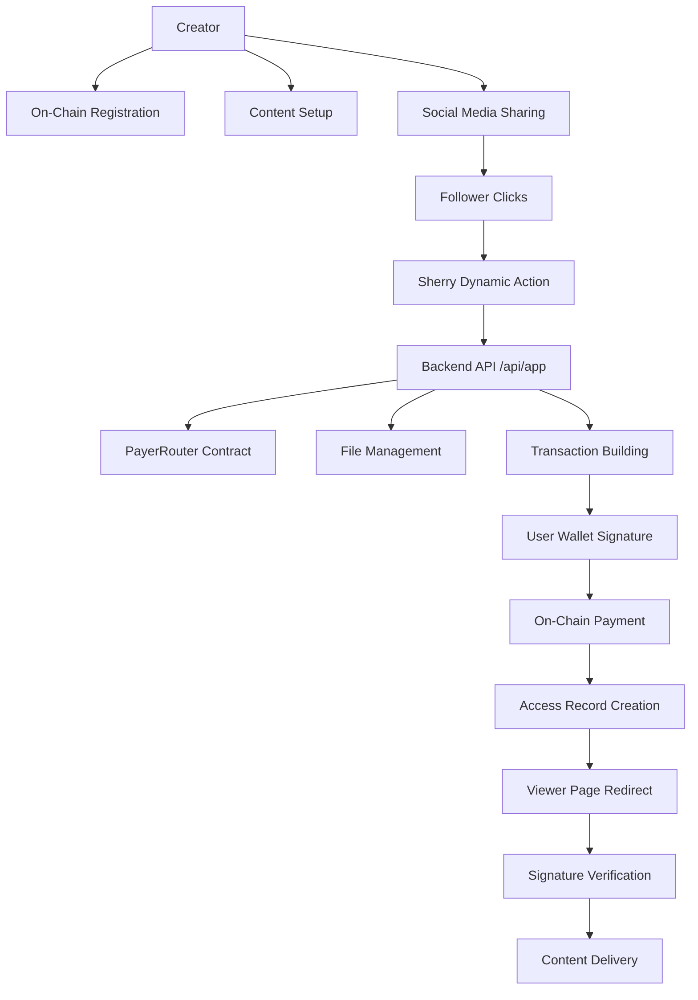

# Payer Tiger (💲,🐅)

Payer Tiger is a monetization toolkit for creators on platforms like X (f.k.a.
Twitter) and Arena. It leverages the Sherry SDK to enable direct, on-platform,
and low-friction payments, allowing creators to earn from their content with a
single click.

## Current Status

- [x] Create T3 App
- [x] Create Foundry project
- [x] Setup Turborepo
- [x] Implement Sherry Dynamic Action metadata endpoint
- [x] Build POST endpoint with smart contract integration
- [x] Add dynamic file management (paywall.json, access_records.json)
- [x] Implement creator handle resolution via PayerRouter contract
- [x] Add comprehensive error handling and debugging
- [x] Create testing infrastructure with TypeScript scripts
- [x] Auto-populate development data for seamless testing
- [ ] Build /viewer page with signature-gated access
- [ ] Implement access verification API endpoint
- [ ] Deploy to production
- [ ] Deploy HTTPayer servers to cloud (future enhancement)
  - [ ] payer server
  - [ ] treasury server
  - [ ] avax facilitator server
  - [ ] demo server
- [ ] Add CI Github Actions

## The Problem: Creator Monetization is Broken

Creators build valuable communities but face significant friction when trying to
monetize their work. The current landscape is inefficient and costly:

- **High Friction:** Off-platform links to Patreon or Gumroad kill conversion by
  forcing users through cumbersome, multi-step checkout flows.
- **Inflexible Models:** Platform subscriptions are often "all-or-nothing,"
  preventing creators from selling access to individual articles, videos, or
  receiving one-off tips.
- **Exorbitant Fees:** Centralized platforms and payment processors can take a
  substantial cut of a creator's revenue.
- **Global Barriers:** Payouts are tied to traditional banking systems, creating
  accessibility issues for creators in many parts of the world.

## The Solution: The On-Chain Monetization Trigger

Payer Tiger solves this by providing a simple, powerful, and decentralized
"trigger" that creators can attach to any piece of content. Our solution is a
**Sherry Dynamic Action** that facilitates a direct, user-signed payment to the
creator, using our on-chain `PayerRouter` contract for address resolution and a
secure, signature-gated delivery mechanism.

### How It Works: A Two-Part System

Payer Tiger operates as a system of two distinct but connected applications: a
**Creator Setup** process and a **Consumer Mini-App** for payments and access.

#### 1. Creator Setup & Social Media Sharing

For the hackathon MVP, we've focused on the core on-chain and backend logic
while creating a seamless sharing experience for creators:

- **On-Chain Registration:** A creator interacts directly with our `PayerRouter`
  smart contract on Avalanche Fuji (e.g., via Remix or Etherscan) to create an
  immutable, on-chain link between their social handle (`@creatorX`) and their
  wallet address.
- **Content Setup:** The creator's premium content (e.g., an unlisted video or a
  private document link) is registered in our system via `paywall.json` which
  maps a `contentId` to the secret content URL and its price.
- **Social Media Sharing:** Creators share their Sherry Mini-App with followers
  using personalized URLs that include their handle and content ID:
  ```
  https://payer-tiger-app.vercel.app/api/app?creatorHandle=@creator1&contentId=premium-article-123
  ```
- **Dynamic Discovery:** The system automatically handles content discovery and
  creates development entries when needed, making testing seamless.

#### 2. The Consumer Payment & Access Flow

This is the core user journey, powered by a single Sherry Dynamic Action that
orchestrates a complex series of events to meet the Minithon's requirements.

1. **Initiate Payment:** A follower clicks the "Unlock Content" button on a
   creator's social media post.
2. **Backend Orchestration (The "Complex Logic"):** Sherry sends a `POST`
   request to our Next.js backend with `creatorHandle` and `contentId`
   parameters. This backend is the brain of the operation and performs our
   **complex custom logic**: a. **Dynamic File Management:** Automatically
   creates and manages `paywall.json` and `access_records.json` files, with
   auto-population for development. b. **Price & Address Resolution:** It reads
   our `paywall.json` to determine the price and makes a read call to the
   `PayerRouter` contract to resolve the creator's wallet address. c.
   **Transaction Building:** It constructs a **single, powerful transaction**
   that calls the `payAndLogAccess` function on our `PayerRouter` contract,
   which transfers the funds and emits an on-chain event logging the access.
3. **User-Signed Transaction:** The backend returns this `serializedTransaction`
   to Sherry. The user's wallet prompts them for **one signature** to approve
   the entire operation.
4. **Secure Access Control:** Upon successful on-chain payment confirmation, the
   backend records the user's wallet address in an `access_records.json` file,
   granting them a non-transferable "access token" for that specific piece of
   content.
5. **Signature-Gated Delivery:** The user is automatically redirected to a
   secure `/viewer` page on our Next.js app. To access the content, the user
   must sign a **free, gas-less message** to prove ownership of the wallet that
   paid. Our backend verifies this signature against the `access_records.json`
   before securely delivering the content, preventing link-sharing.

### Technical Architecture



### Smart Contract Integration

- **PayerRouter Contract:** `0x994519B71387380F30Be925a75a5593cffacd401`
  (Avalanche Fuji)
- **USDC Contract:** `0x5425890298aed601595a70AB815c96711a31Bc65` (Avalanche
  Fuji)
- **Key Functions:**
  - `getPayee(string _handle)`: Resolves creator handle to wallet address
  - `payAndLogAccess(bytes32 contentId, string creatorHandle, address token, uint256 amount)`:
    Processes payment and logs access

### Technology Stack

- **Frontend Embedding:** Sherry SDK
- **Core Logic:** Sherry Dynamic Action
- **Backend & Viewer:** Next.js (Route Handlers & App Router)
- **Smart Contracts:** Solidity, Foundry (`PayerRouter`)
- **Blockchain:** Avalanche Fuji
- **Stablecoin:** USDC
- **Libraries:** `viem`, `wagmi`
- **Development:** TypeScript, tsx for script execution
- **Package Manager:** pnpm
- **Wallet:** MetaMask, Core

## Development & Testing

### Local Development Setup

1. **Install Dependencies:**
   ```bash
   cd app
   npm install
   ```

2. **Start Development Server:**
   ```bash
   npm run dev
   ```

3. **Test the API Endpoint:**
   ```bash
   npm run test:post
   ```
   or
   ```bash
   npx tsx scripts/test-post.ts
   ```

### API Endpoints

- **GET `/api/app`:** Returns Sherry Dynamic Action metadata
- **POST `/api/app`:** Handles payment transaction creation
  - Query Parameters: `creatorHandle`, `contentId`
  - Returns: `ExecutionResponse` with serialized transaction

### File Structure

```
app/
├── src/
│   ├── app/
│   │   └── api/
│   │       └── app/
│   │           └── route.ts          # Main Sherry endpoint
│   │   ├── blockchain/
│   │   │   ├── fujiPayerRouterAbi.ts     # PayerRouter contract ABI
│   │   │   └── fujiUsdcAbi.ts            # USDC contract ABI
│   │   └── data/
│   │       ├── paywall.json              # Content pricing data
│   │       └── access_records.json       # User access records
│   ├── scripts/
│   │   └── test-post.ts                  # Testing script
│   └── package.json
```

### Error Handling & Debugging

The system includes comprehensive error handling:

- **File Management:** Auto-creation of missing JSON files
- **Contract Errors:** Detailed error messages for on-chain failures
- **Development Support:** Auto-population of test data
- **Debug Information:** Enhanced error responses with detailed messages

### Hackathon MVP Scope vs. Future Vision

- **Hackathon MVP Focus:** Our submission is a robust, end-to-end system
  demonstrating a **complex, multi-step smart contract interaction and secure
  delivery flow**. We prove the core value proposition by enabling a user to pay
  a creator directly via a single user-signed transaction, with payment routing
  handled by our on-chain `PayerRouter` and content access secured by
  cryptographic signatures.

- **Future Vision (Post-Hackathon):** The infrastructure built for this MVP is
  the foundation for our long-term vision. The next phases include:
  - **Creator Portal:** Building a full-fledged Next.js dashboard for creators
    to self-serve onboarding and content management.
  - **Wallet-less Payments:** Integrating our `HTTPayer` service and the `x402`
    protocol to offer a fully abstracted payment experience, allowing users
    without Web3 wallets to pay seamlessly and dramatically expanding the
    accessible market for creators.
  - **Multi-Chain Support:** Expanding beyond Avalanche to other EVM chains.
  - **Advanced Content Types:** Supporting various media types and delivery
    methods.
